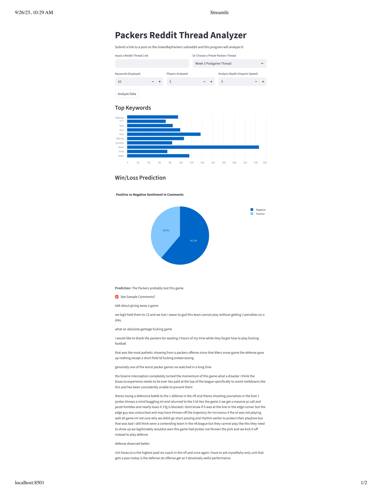
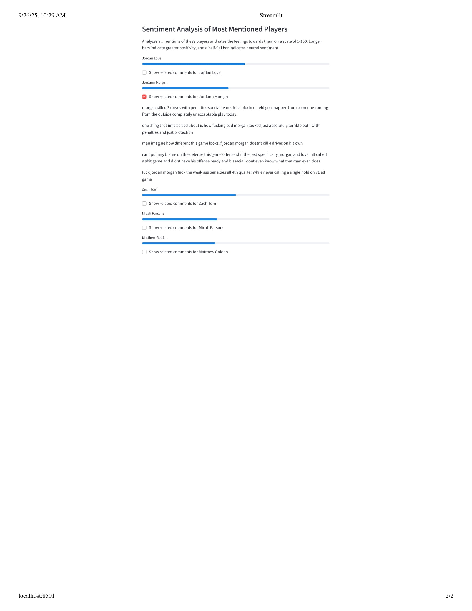

# Packers Gameday Thread Analyzer
This is a tool to scrape the comments off a Reddit gameday thread, in which fans discuss an ongoing sports game. It will be particularly focused towards analyzing threads in the Green Bay Packers (American football team) subreddit. It can analyze any sports subreddit, but the player analysis will only work on threads involving Packers players.

## Screenshot of the Analyzer in Use

## Concepts Learned
- first, I went to https://praw.readthedocs.io/en/stable/tutorials/comments.html to learn how to get the comments from the Reddit API
- reviewed regex and how to efficiently preprocess words
- learned some basics of the spacy library
- the rest of what I learned is in the journal below

## Journal
### 9.19
I figured out that I can't just leak my Reddit app's secret, so it took my a long time to clear out my old commits and make a new environment that didn't reveal it to everybody. After that, I cleared out some bad words that came up and also some words that didn't get caught by my previous stopwords function inherent to spacy.

### 9.20
I ranked the keywords most commonly seen in the gameday thread. I kept adding new words to my stopwords list, because words like "look" or "good" are not as useful as words like "refs" or "Parsons" (a player name). I also added a list of the Packers roster and used it to look through the lemmatized words and see which players were mentioned the most often. There was some margin of error (for example, parson not counting for Micah Parsons), which I might fix in my next edit.

### 9.21
I added some general analysis of the comments that can show the overall sentiment of the comment thread. I also edited the displayed most mentioned names that fixed that lemmitization was removing the "s" at the end of Parsons' name, and now it only displays the top 5 names. This code was all pretty simple except for learning a little bit more about Counter() and how the vader lexicon works.

### 9.22
I decided to analyze the comments involving the top 5 mentioned players. I also added some more data with game threads from when the Packers lose. I think some things are getting thrown off in the analysis, because in one game, Jordan Love played very badly, but still had a positive sentiment analysis score. I think this might be due to the word 'love' often being used in a positive context. One more thing I did was to just do a quick comparison of negative comments vs positive comments to predict whether the Packers won the game, which surprisingly has been accurate, albeit in a small sample size.
A bit later, I organized the code into functions, so it will be easier to turn into a streamlit webpage during my next coding session.

### 9.23
Developed it into a web app with streamlit. It was much easier since (a) I had already made an app using streamlit [the baseball card simulator] and (b) this only involved displaying data with minimal moving parts. Overcame a couple small hiccups learning how to use progress bars and bar graphs with pandas, and also solved a bug that ran the code in analyzer.py every time, which sped up run times considerably.

### 9.24
Made a number of small adjustments to the website to improve the overall experience. The most notable are the ability to adjust some parameters for the analysis and the display of comments in different sections of the analysis. The final touch I want to make is add rosters for every NFL team, so it can be used on other subreddits too.

### 9.25
Struggled deploying the streamlit website, because the secrets didn't automatically load and many packages wouldn't install like I expected, so I learned the importance of a good requirements.txt file. Gemini and ChatGPT both gave me a lot of useless advice, but by trying different things on my own I finally got it to work. This is the final, polished version.